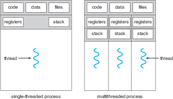

# Session 2: Threads

The second session of this lab will contain some exercises about threads. In session 1
you learned about process and how they work. In this assignment you will use
threads and these threads will be used in all other session of this lab. The objectives of this
session are listed below.

- Learn what a thread is and how you could create one
- Learn how you could use the I/O interface of the Raspberry Pi

## Assignments

A thread is a basic unit of CPU utilisation; it comprises a thread ID, a program counter, a register
set, and a stack. It shares with other threads belonging to the same process its code section, data
section, and other operating-system resources, such as open files and signals. A traditional (or
heavyweight) process has a single thread of control. If a process has multiple threads of control,
it can perform more than one task at a time. Since each unique thread has its own memory, it is
a lot faster to create and destroy threads.

In this session you will learn how to create threads. The concept of threads will be further
utilised by all the other assignments of this lab. The next session is about multithreading and the
advantage of threads above processes.

### Using I/O on Raspberry Pi

This tutorial will state information with regards to the input/output (I/O) functionalities of the
Raspberry Pi. To make it easy, we will use a library which provides a set of functions to
communicate with the I/O pins of the Raspberry Pi. This lab will use the Wiring Pi library. This
tutorial will mention the basic functions you have to use during this lab. If you want to use more
advanced functions you could find a detailed reference on the website of WiringPi
\url{http://www.wiringpi.com/reference}

Before using the WiringPi I/O library, you need to include its header file in your programs:

    #include <wiringPi.h>

We have to link against the library in the compilation process.
The library is installed in the C library on the linux image used in the lab.
To link against it when compiling using gcc on the PI, we use the following gcc flags:

		-I/usr/local/include -L/usr/local/lib -lwiringPi

This line is part of the makefile in the session template.

When you have successfully included the library you are able use the WiringPi functions.
The first thing you have to do is to call the function `wiringPiSetup()`.

    // Setup WiringPi
    wiringPiSetup();

Now you are all set to set the mode of the pins.
Each pin can be set to several modes and therefor you have to select the right one in order to
operate the pin correctly.
To select the different pin modes you could use the function `pinMode(int pin, int mode)`;
for example:

    // Set LED1 pin to output
    pinMode(LED1, OUTPUT);

Another function you will be going to use is the function to change the output value of the LED pins
in order to turn the LED on or off.
You could change the output value to low or high using the function
`digitalWrite(int pin, int value)`.

    // Turn LED on
    digitalWrite(LED1, HIGH);

    // Turn LED off
    digitalWrite(LED1, LOW);

The previously stated functions will allow you to turn the LED's on or off, more specifically the
first function turns LED1 on, and the second one turns it off. The functions mentioned below can be
used to control the LED's with a Pulse Width Modulated signal (PWM).
PWM can be used to control the brightness of the LED's.
Additionally PWM can be used to fade-in and fade-out the LED's.
The LED's which you will be going to control with PWM signals must be initialised differently than
just turning LED's on and off.
The function `softPwmCreate(int pin, int initialValue, int pwmRange)` is used to initialise the LED.
In this function you have to enter a initial value (0 for off and 100 for fully on) and the
`pwmRange` which should be 100.

The function `softPwmWrite(int pin, int value)` is used to update the PWM value of the LED.
For PWM we use the soft PWM library because there is only one pin on the Raspberry Pi which allows
hardware PWM.
Soft PWM means a thread is created which controls the LED with the corresponding PWM value.
Before you can use the functions for PWM you have to include the soft PWM library.

    // Include headers
    #include <wiringPi.h>
    #include <softPwm.h>

    // Initialise pin for PWM output
    softPwmCreate(LED1, 0, 100);

    // Update the PWM value of a LED
    softPwmWrite(LED1, 50);

### 2.1

The objective of this assignment is creating a new thread. You have to include the POSIX Thread
library in order to create a thread in your main function. The only thing you have to implement in
your main function is the creation of a thread, waiting for the thread to finish and killing the
program.

The objectives are:

- The main function must create a thread, wait till the thread is finished and
  finally close the program.
- Print the thread ID and function name of the thread
- Create a counter which counts from 1 to 10 and wait 1 second between each increment

### 2.2

In this assignment you will - just as in assignment 2.1 - create a thread. Basically the same main
functions can be used. However, instead of using a timer you will use the input/output port of the
Raspberry Pi. In this assignment you have to use the output function of this port to blink multiple
LED's.

The objectives are:

- The main function must create a thread, wait till the thread is finished and finally close the
  program.
- Initialise the LED pins as output
- Create a certain pattern with the LED's
- Close the thread after 20 seconds

The pattern named above may be every pattern you like!
It could be some difficult pattern or just simple blinking of LED's
You will receive recognition for making it blink to the rhythm of "You & Me - Flume Remix".

### Bonus: Sudoku Solution Validator

A Sudoku puzzle uses a 9 × 9 grid in which each column and row, as well as each of the nine
3 × 3 subgrids, must contain all of the digits 1···9. The next figure presents an example of
a valid Sudoku puzzle. This project consists of designing a multithreaded application that
determines whether the solution to a Sudoku puzzle is valid.

There are several different ways of multithreading this application.
One suggested strategy is to create threads that check the following criteria:

- A thread to check that each column contains the digits 1 through 9
- A thread to check that each row contains the digits 1 through 9
- Nine threads to check that each of the 3 × 3 subgrids contains the digits 1 through 9

This would result in a total of eleven separate threads for validating a Sudoku puzzle. However, you
are welcome to create even more threads for this project. For example, rather than creating one
thread that checks all nine columns, you could create nine separate threads and have each of them
check one column.

#### Passing Parameters to Each Thread

The parent thread will create the worker threads, passing each worker the location that it must
check in the Sudoku grid. This step will require passing several parameters to each thread. The
easiest approach is to create a data structure using a struct. For example, a structure to pass the
row and column where a thread must begin validating would appear as follows:

    /* structure for passing data to threads */
    typedef struct {
       int row;
       int column;
    } parameters;

Both Pthreads and Windows programs will create worker threads using a strategy similar to that shown
below:

    parameters *data = (parameters *) malloc(sizeof(parameters));
    data->row = 1;
    data->column = 1;
    /* Now create the thread passing it data as a parameter */

The data pointer will be passed to the `pthread create()` (Pthreads) function,
which in turn will pass it as a parameter to the function that is to run as a separate thread.

#### Returning Results to the Parent Thread

Each worker thread is assigned the task of determining the validity of a particular region of the
Sudoku puzzle. Once a worker has performed this check, it must pass its results back to the parent.
One good way to handle this is to create an array of integer values that is visible to each thread.
The ith index in this array corresponds to the ith worker thread. If a worker sets its corresponding
value to 1, it is indicating that its region of the Sudoku puzzle is valid. A value of 0 would
indicate otherwise. When all worker threads have completed, the parent thread checks each entry in
the result array to determine if the Sudoku puzzle is valid.
